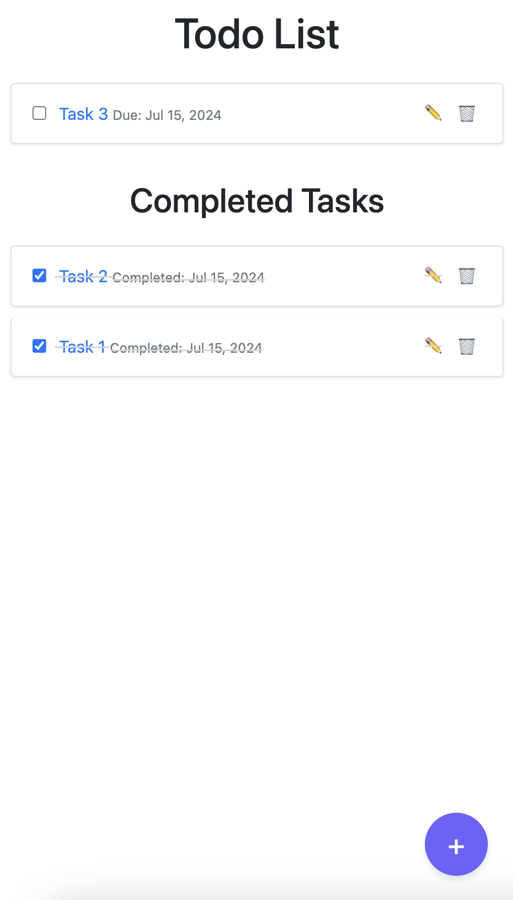

# Laravel Todo Application

This is a simple Todo application built with Laravel and MySQL. It allows users to create, read, update, and delete (CRUD) todo items, manage due dates, and mark items as completed.

## Features

- Create new todo items with optional descriptions and due dates
- View a list of all todo items, categorized by completion status
- Update existing todo items
- Delete todo items
- Mark todo items as completed, tracking the completion date
- Tasks are ordered by due date and completed tasks by completion date

## UI Example

For a visual representation of the application, see the example screenshot below:

<p align="center">
  
</p>

## Requirements

- PHP 7.3 or higher
- Composer
- MySQL
- Node.js and npm

## Installation

### Clone the Repository

```bash
git clone https://github.com/hjungwoo01/laravel-todo-app.git
cd laravel-todo-app
```

### Install PHP Dependencies

```bash
composer install
```

### Install JavaScript Dependencies

```bash
npm install
```

### Configure Environment

Copy the `.env.example` file to `.env` and update the database configuration.

```bash
cp .env.example .env
```

Update the `.env` file with your database credentials.

```plaintext
DB_CONNECTION=mysql
DB_HOST=127.0.0.1
DB_PORT=3306
DB_DATABASE=todo_app
DB_USERNAME=root
DB_PASSWORD=your_mysql_root_password
```

### Generate Application Key

```bash
php artisan key:generate
```

### Run Migrations

```bash
php artisan migrate
```

### Start the Development Server

```bash
php artisan serve
```

### Compile Assets

```bash
npm run dev
```

## Usage

### Access the Application

Open your browser and navigate to `http://localhost:8000/todos`.

### CRUD Operations

- **Create a New Todo:** Click on "Create New Todo" and fill out the form.
- **View Todos:** The homepage lists all todos, ordered by due date and categorized by completion status.
- **Edit a Todo:** Click on "Edit" next to a todo item, update the form, and save.
- **Delete a Todo:** Click on "Delete" next to a todo item.
- **Mark a Todo as Completed:** Click the checkbox next to a todo item. Completed tasks are tracked with a completion date and are moved to the "Completed Tasks" section.

## Project Structure

- `app/Http/Controllers/TodoController.php`: Handles CRUD operations.
- `app/Models/Todo.php`: The Todo model.
- `resources/views/todos`: Blade templates for the application.
- `routes/web.php`: Application routes.
- `database/migrations`: Database migration files.

## Contributing

1. Fork the repository.
2. Create a new branch (`git checkout -b feature/your-feature`).
3. Commit your changes (`git commit -am 'Add some feature'`).
4. Push to the branch (`git push origin feature/your-feature`).
5. Create a new Pull Request.

## Acknowledgements

- [Laravel](https://laravel.com/)
- [MySQL](https://www.mysql.com/)
- [phpMyAdmin](https://www.phpmyadmin.net/)
- [MySQL Workbench](https://www.mysql.com/products/workbench/)
